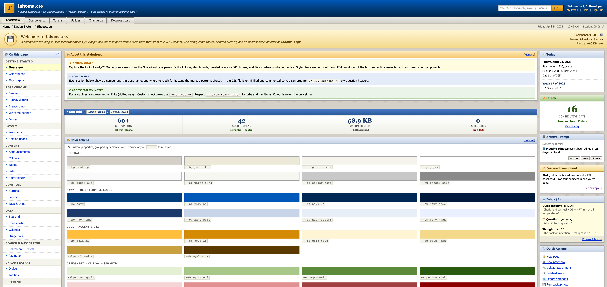

# tahoma.css

A 2000s corporate web design system. Drop in one stylesheet and your plain
HTML looks like a 2003 SharePoint intranet portal — Tahoma 11px body, navy
gradient banners, gold CTAs, beveled buttons, zebra tables, web parts.

**No JavaScript. No build step. No web fonts.** One CSS file, system fonts only.



## Install

Copy [`style.css`](./style.css) into your project and link it:

```html
<!DOCTYPE html>
<html lang="en">
  <head>
    <meta charset="UTF-8" />
    <meta name="viewport" content="width=device-width, initial-scale=1" />
    <title>Corporate Portal</title>
    <link rel="stylesheet" href="style.css" />
  </head>
  <body>
    <!-- your markup -->
  </body>
</html>
```

Plain HTML elements (`h1`–`h6`, `p`, `a`, `table`, `input`, `button`, `pre`,
`blockquote`, `code`, `kbd`, `hr`, `fieldset`, `legend`) are styled out of the
box. Reach for class helpers when you want richer components.

## A quick example

```html
<div class="banner">
  <div class="logo">C</div>
  <div class="title-area">
    <div class="title">Contoso Portal</div>
    <div class="subtitle">Corporate Intranet</div>
  </div>
</div>
<div class="subnav">
  <a class="tab active">Home</a>
  <a class="tab">News</a>
  <a class="tab">Documents</a>
</div>

<div class="wrap">
  <div class="layout">
    <div class="left-col">
      <ul class="nav-list">
        <li class="section">Workspaces</li>
        <li><a class="current">Overview</a></li>
        <li><a>Reports</a></li>
      </ul>
    </div>
    <div class="main-col">
      <div class="webpart wp-orange full">
        <div class="webpart-header"><span>📢 Announcements</span></div>
        <div class="webpart-body">Q2 all-hands moved to Thursday 3pm.</div>
      </div>
    </div>
    <div class="right-col">
      <div class="webpart">
        <div class="webpart-header"><span>📅 Today</span></div>
        <div class="webpart-body">No meetings.</div>
      </div>
    </div>
  </div>
</div>

<div class="footer">
  <div>© 2003 Contoso Corp.</div>
  <div>✓ Best viewed in Internet Explorer 6.0+</div>
</div>
```

See [`index.html`](./index.html) for a comprehensive showcase of every component.
Serve it from a local web server rather than opening the file directly — for example:

```sh
python -m http.server
```

then visit <http://localhost:8000>.

## What's in the box

- **Page chrome** — `.banner`, `.subnav`, `.breadcrumb`, `.welcome-banner`, `.footer`
- **Layout** — 3-column `.layout` (220 / 1fr / 240) with `.two-col`, `.flipped`, `.wide` variants
- **Web parts** — `.webpart` panels in navy / orange / green / red / gold / plum;
  collapsible via `<details>`
- **Data** — `.corp-table`, `.activity-table`, `.factsheet`, `.cal-table`,
  `.usage-table`, `.stat-grid`, `.shelf-grid`
- **Lists** — `.nav-list`, `.tree-list`, `.task-list`, `.event-list`, `.q-list`
- **Buttons** — `.btn`, `.btn-primary`, `.btn-go` (gold CTA), `.btn-danger`,
  `.wbtn` (toolbar), `.tbtn` (table), `.cbtn` (capture)
- **Forms** — styled `<input>` / `<select>` / `<textarea>`, `.form-row`, `<fieldset>` / `<legend>`
- **Status & inline** — `.tag`, `.status-lozenge`, `.prio`, `.chip`,
  `.announce`, `.callout`
- **Wiki bits** — `.wikilink`, `.attachment`, `.comment`, `.vhist`,
  `.backlink-item`, `.formula-block`
- **Search** — `.search-hero`, `.facet`, `.result`, `.pagination`
- **Lo-fi Tailwind** utilities for text, background, spacing, flex, grid

For the full component reference, see [`SKILL.md`](./docs/SKILL.md).

## Theming

All custom properties are namespaced `--bp-*`. Override on `:root` to retheme
without touching component rules:

```css
:root {
  --bp-navy: #1f3a5f;
  --bp-gold-hi: #f4c430;
}
```

## The look

Density beats whitespace. 11px text, 4–8px padding, 1px borders. Lots of small
panels beats one big one. Headings cap at 22px. Status goes UPPERCASE and tiny.
Numbers go big and serif. Right angles only — no `border-radius`, no soft
shadows, no avatar circles, no neon.

If your output has rounded buttons, gradient text, backdrop blur, or anything
that looks like it shipped after 2007 — it's not tahoma.css anymore.

## Scripts

```sh
npm run lint        # oxlint
npm run lint:fix
npm run format      # oxfmt --check
npm run format:fix
```

## License

Licensed under the [MIT license](./LICENSE).
